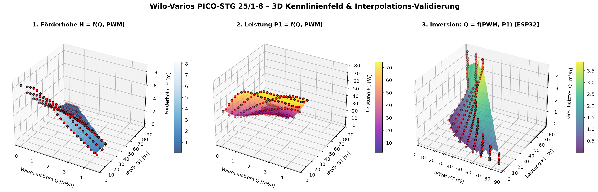

# Wilo-Varios PICO-STG (25/1-8) – Technische Referenz & Kennlinienfeld

Technische Dokumentation, elektrische Schnittstellen, iPWM-Steuerung und Kennlinienanalyse für die Hocheffizienz-Umwälzpumpe **Wilo-Varios PICO-STG 25/1-8**.

---

## 1. Übersicht & Technische Daten

Die **Wilo-Varios PICO-STG** ist eine elektronisch geregelte Nassläufer-Umwälzpumpe für Warmwasser-Heizungsanlagen, Fußbodenheizungen sowie Solar- und Geothermiesysteme.

* **Typenschlüssel:** `Wilo-Varios PICO-STG 25/1-8`
  * `STG`: Solar, Thermal, Geothermal & Heating
  * `25`: Nennweite Verschraubung DN 25 (Rp 1 / G 1½" Gewinde)
  * `1-8`: Förderhöhenbereich 1 m bis 8,3 mWS (bei $Q = 0\,\text{m}^3/\text{h}$)
* **Netzspannung:** 1~230 V ± 10 %, 50/60 Hz
* **Leistungsaufnahme ($P_1$):** ca. 2,5 W (Minimallast) bis 75 W (Volllast bei $Q > 1{,}5\,\text{m}^3/\text{h}$)
* **Energieeffizienzindex (EEI):** $\le 0{,}20$
* **Zulässige Medien:**
  * Heizungswasser nach VDI 2035
  * Wasser-Glykol-Gemische bis maximal 50 % Glykol
* **Medientemperatur:** -20 °C bis +95 °C (Heizung/GT) bzw. bis +110 °C (Solar ST)
* **Maximaler Betriebsdruck:** 10 bar (1000 kPa)
* **Schutzart:** IPX4D

---

## 2. Elektrische Anschlüsse

### A. Netzanschluss (230 V AC)
* **Wilo-Connector (3-polig):** `L` (Phase), `N` (Neutralleiter), `PE` (Schutzleiter).
* Die 230V-Netzfreigabe erfolgt im Verteiler über die Relais 9 bis 12 des MCP23017.

### B. iPWM-Signalkabel (Steuereingang & Feedback)
Die Pumpe verfügt über eine dedizierte 3-polige iPWM-Schnittstelle:

| Pin | Aderfarbe | Signalrichtung | Signalpegel | Funktion am ESP32-C6 / Verteiler |
|---|---|---|---|---|
| **1** | **Braun** | **Eingang** (vom Regler zur Pumpe) | 3,6 V – 24 V, 100 Hz – 5 kHz (1000 Hz nominal) | Drehzahl-Sollwert vom **PCA9685** (über PC817 Optokoppler) |
| **2** | **Blau / Grau** | **Masse (GND)** | 0 V Referenz | Gemeinsame Signalmasse der Optokoppler-Schnittstelle |
| **3** | **Schwarz** | **Ausgang** (von der Pumpe zum Regler) | 75 Hz VDMA Open-Collector | VDMA-Feedback an **GPIO0–GPIO21** (über PC817 Optokoppler) |

> [!CAUTION]
> Niemals 230 V Netzspannung an den iPWM-Eingang anlegen! Der Eingang ist für galvanisch getrennte Niederspannung (maximal 24 V getaktet) ausgelegt.

---

## 3. Externe Drehzahlregelung: iPWM GT Modus (Heizung)

Für die Heizkreissteuerung wird die Pumpe auf **externe Regelung** im Modus **iPWM GT (Geothermie / Heizung)** konfiguriert. 

### Signalcharakteristik (Invertierte Kennlinie mit Kabelbruchsicherheit):
Im iPWM-GT-Modus läuft die Pumpe bei getrenntem Signalkabel oder 0 % PWM aus Sicherheitsgründen mit **maximaler Förderleistung**, um ein Einfrieren oder Überhitzen des Kessels zu verhindern:

```text
Drehzahl n
   ▲
nmax │ ─────┐
     │      │\
     │      │ \
     │      │  \   Drehzahl sinkt linear
     │      │   \
nmin │      │    \────────┐
     │      │             │
   0 └──────┴─────────────┴─────┴────────► PWM [%]
     0      5             85    93   100
```

| iPWM Tastgrad [%] | Betriebszustand | Pumpendrehzahl |
|---|---|---|
| **< 5 %** | **Sicherheits-Vollast** (Kabelbruch / kein Signal) | Maximale Drehzahl ($n_{\max}$, Förderhöhe bis 8,3 m) |
| **5 % – 85 %** | **Regelbereich (Linear fallend)** | Drehzahl sinkt proportional von $n_{\max}$ auf $n_{\min}$ |
| **85 % – 93 %** | **Minimallast** | Minimale Drehzahl ($n_{\min}$, Förderhöhe ca. 0,2 m) |
| **93 % – 100 %** | **Bereitschaft (Standby)** | Pumpe stoppt / Motor aus |

*Hinweis für die ESP32-Software:*  
Um eine logische Ansteuerung (0 % = Stopp, 100 % = Vollgas) zu erzielen, wird der geforderte Prozentwert firmwareseitig umgerechnet:
$$\text{PWM}_{\text{iPWM\_GT}} = 85\% - \left(\frac{\text{Sollwert}_{\%}}{100} \cdot (85\% - 5\%)\right) \quad \text{für } \text{Sollwert} > 0$$
Bei $\text{Sollwert} = 0\,\%$ wird das Signal auf $\ge 95\,\%$ gesetzt bzw. das 230V-Relais abgeschaltet.

---

## 4. VDMA-Feedback (75 Hz Rückmeldesignal)

Über die schwarze Ader (Pin 3) gibt die Pumpe ein Rechtecksignal mit fester Frequenz von **75 Hz** aus. Das Tastverhältnis (Duty Cycle) übermittelt Diagnoseinformationen und die **aktuelle Leistungsaufnahme**:

| Duty Cycle [%] | Status | Bedeutung | Leistungsinterpretation |
|---|---|---|---|
| **0 – 5 %** | `SIGNAL_LOST` | Signalkabel unterbrochen oder kein Feedback | $0\,\text{W}$ |
| **5 – 70 %** | `OK` (Normalbetrieb) | Pumpe läuft im Normalbereich | $P_1 = \frac{\text{Duty} - 5\%}{65\%} \cdot P_{\max}$ (ca. $0 \dots 75\,\text{W}$) |
| **75 – 80 %** | `STANDBY` | Pumpe im Bereitschaftsmodus | $0\,\text{W}$ |
| **80 – 90 %** | `WARNING` | Überlast, Übertemperatur oder Notlauf | Reduzierte Drehzahl |
| **90 – 100 %** | `ERROR` | Rotor blockiert, Trockenlauf oder Hardwaredefekt | Abschaltung / Alarm |

---

## 5. Kennlinienfeld & Durchflussschätzung ($Q_{\text{est}}$)

Aus den Hersteller-Messdaten wurden 9 Kennlinien für den iPWM-GT-Betrieb digitalisiert:
* **PWM-Stufen:** 5 % ($n_{\max}$), 15 %, 25 %, 35 %, 45 %, 55 %, 65 %, 75 %, 85 % ($n_{\min}$)
* **Zugehörige Rohdaten-Datei:** [`docs/wilo_varios_pico_stg_kennlinien.csv`](file:///c:/Users/Friedrich%20Nowacki/Documents/PlatformIO/khv/docs/wilo_varios_pico_stg_kennlinien.csv)

> [!IMPORTANT]
> **Vollständigkeit der Kennliniendaten:**
> Die nachfolgenden Tabellen in dieser Dokumentation dienen lediglich als kompakte Übersicht und enthalten **nicht alle Messdaten**. 
> Der **vollständige Datensatz mit allen digitalisierten Stützstellen befindet sich in der Datei [`docs/wilo_varios_pico_stg_kennlinien.csv`](file:///c:/Users/Friedrich%20Nowacki/Documents/PlatformIO/khv/docs/wilo_varios_pico_stg_kennlinien.csv)**. 
> Für Berechnungen, Interpolationen, die 3D-Validierung und die Firmware-Lookup-Table **müssen ausnahmslos alle Datenpunkte der CSV-Datei verwendet werden**.

### A. Förderhöhen-Kennlinien $H(Q)$ (Auszug/Übersicht)
| PWM [%] | $H$ bei $Q=0\,\text{m}^3/\text{h}$ | $H$ bei $Q=1{,}0\,\text{m}^3/\text{h}$ | $H$ bei $Q=2{,}0\,\text{m}^3/\text{h}$ | $H$ bei $Q=3{,}0\,\text{m}^3/\text{h}$ | $Q_{\max}$ ($H \approx 1{,}4\,\text{m}$) |
|:---:|:---:|:---:|:---:|:---:|:---:|
| **5 %** ($n_{\max}$) | **8,32 m** | 8,24 m | 6,11 m | 3,92 m | **4,55 m³/h** |
| **15 %** | **6,57 m** | 6,55 m | 5,86 m | 3,93 m | **4,55 m³/h** |
| **25 %** | **4,99 m** | 4,93 m | 4,42 m | 3,44 m | **4,43 m³/h** |
| **35 %** | **3,68 m** | 3,59 m | 3,02 m | 2,04 m | **3,70 m³/h** |
| **45 %** | **2,54 m** | 2,43 m | 1,86 m | 0,84 m | **3,00 m³/h** |
| **55 %** | **1,61 m** | 1,39 m | 0,61 m | – | **2,32 m³/h** |
| **65 %** | **0,94 m** | 0,76 m | – | – | **1,65 m³/h** |
| **75 %** | **0,42 m** | 0,23 m | – | – | **1,06 m³/h** |
| **85 %** ($n_{\min}$) | **0,17 m** | – | – | – | **0,40 m³/h** |

### B. Leistungs-Kennlinien $P_1(Q)$
Die Leistungsaufnahme $P_1$ steigt mit zunehmendem Durchfluss $Q$:
| PWM [%] | $P_1$ bei $Q=0$ (Nullförderung) | $P_1$ bei $Q=1{,}0\,\text{m}^3/\text{h}$ | $P_1$ bei $Q=2{,}0\,\text{m}^3/\text{h}$ | $P_1$ bei $Q=3{,}0\,\text{m}^3/\text{h}$ | $P_{\max}$ (Vollast) |
|:---:|:---:|:---:|:---:|:---:|:---:|
| **5 %** ($n_{\max}$) | **40,8 W** | 69,1 W | 74,6 W | 73,5 W | **75,0 W** |
| **15 %** | **29,9 W** | 52,8 W | 71,6 W | 73,4 W | **74,7 W** |
| **25 %** | **21,4 W** | 38,5 W | 53,6 W | 65,5 W | **70,5 W** |
| **35 %** | **14,9 W** | 27,4 W | 37,3 W | 44,1 W | **45,2 W** |
| **45 %** | **10,2 W** | 18,6 W | 24,8 W | 27,0 W | **27,2 W** |
| **55 %** | **7,0 W** | 12,0 W | 15,2 W | – | **15,2 W** |
| **65 %** | **4,5 W** | 7,3 W | – | – | **8,0 W** |
| **75 %** | **3,2 W** | 4,2 W | – | – | **4,2 W** |
| **85 %** ($n_{\min}$) | **2,5 W** | – | – | – | **2,8 W** |

### C. Funktionsweise der Durchflussschätzung ($Q_{\text{est}}$)
Da bei einer gegebenen Drehzahl ($PWM$) die Leistungsaufnahme $P_1$ eindeutig vom geförderten Volumenstrom $Q$ abhängt (je mehr Wasser fließt, desto mehr mechanische Arbeit leistet das Laufrad), lässt sich die Funktion invertieren:
$$Q_{\text{est}} = f(PWM_{\text{soll}}, P_{\text{feedback}})$$

1. Der ESP32 kennt den an den PCA9685 ausgegebenen **PWM-Sollwert**.
2. Über das 75-Hz-Rückmeldesignal ermittelt der ESP32 die aktuelle **Leistungsaufnahme $P_{\text{el}}$ in Watt**.
3. Über eine **2D-Lookup-Table mit bilinearer Interpolation** ermittelt der ESP32 den aktuellen Durchfluss in $\text{l}/\text{h}$:
   * Bei geschlossenem Kreis ($Q \approx 0$): Leistung sinkt auf das Leerlaufniveau der jeweiligen Drehzahl (z. B. 40,8 W bei 100 % Drehzahl).
   * Bei offenem Kreis ($Q > 2\,\text{m}^3/\text{h}$): Leistung steigt auf das Maximum (bis 75 W).

### D. 3D-Kennlinienfeld & Interpolations-Validierung (Python)
Zur Überprüfung der Messpunkte und visuellen Begutachtung der Interpolationsflächen steht das Python-Skript [`tools/plot_pump_curves_3d.py`](file:///c:/Users/Friedrich%20Nowacki/Documents/PlatformIO/khv/tools/plot_pump_curves_3d.py) zur Verfügung.

Beim Starten öffnet sich **direkt ein interaktives 3D-Fenster**, in dem die 3D-Diagramme mit der Maus frei gedreht, gekippt und gezoomt werden können (gleichzeitig wird automatisch ein aktualisiertes Bild [`docs/wilo_pump_curves_3d.png`](file:///c:/Users/Friedrich%20Nowacki/Documents/PlatformIO/khv/docs/wilo_pump_curves_3d.png) gespeichert):

```bash
# 1. Option: Direkt über das Terminal:
python tools/plot_pump_curves_3d.py

# 2. Option: Nur Bild erzeugen ohne interaktives Fenster (Headless):
python tools/plot_pump_curves_3d.py --headless
```



---

## 6. LED-Codierung & Störmeldeanzeige

Die Pumpe verfügt über Bedientasten und eine mehrfarbige LED-Anzeige zur Statusdiagnose:

| LED-Zustand | Ursache | Maßnahme |
|---|---|---|
| **Dauerhaft Grün** | Normalbetrieb nach eingestellter Regelungsart | Keine Aktion erforderlich |
| **Dauerhaft Rot** | **Rotor blockiert** oder Wicklungsdefekt | Automatischen/manuellen Neustart ausführen (untere Taste 5s halten); Fremdkörper entfernen |
| **Blinkt Rot** | Unter-/Überspannung, Modulüberhitzung oder Motor-Kurzschluss | Netzspannung und Kühlung prüfen |
| **Blinkt Rot/Grün** | **Generatorbetrieb** (Pumpe wird ohne Netzspannung fremddurchströmt), **Trockenlauf** oder Überlast | Entlüftung durchführen, Anlagendruck prüfen, Wasservorlauf kontrollieren |

### Sonderfunktionen:
* **Entlüftungsfunktion:** Obere Bedientaste für **5 Sekunden gedrückt halten**. Die Pumpe wechselt für 10 Minuten in ein zyklisches Drehzahlprogramm zur Schnellentlüftung des Gehäuses.
* **Manueller Deblockier-Neustart:** Untere Bedientaste für **5 Sekunden gedrückt halten**. Die Pumpe erzeugt gezielte Losbrechmomente.
* **Sync-Funktion (Austauschspiegel):** Beide Bedientasten gleichzeitig für **5 Sekunden drücken**, um LED-Codes für spezifische Pumpenkennlinien von Altgeräten (z. B. Wilo-Star RS) einzulernen.

---

## 7. Vergleich & Einsatz der COSMO CP-HY 25-75/180 (Heizkreis 2: OG 5)

Im Heizungsverteiler sind 4 Heizkreise mit folgenden Pumpenmodellen bestückt:

| Heizkreis | Zuordnung / Ebene | Typ | Installiertes Pumpenmodell | Kennlinien-Basis |
|---|---|---|---|---|
| **HK 1** | **EG 5** | Fußbodenheizung (FBH) | **Wilo-Varios PICO-STG 25/1-8** | Wilo-Kennlinienfeld |
| **HK 2** | **OG 5** | Heizkörper (RAD) | **COSMO CP-HY 25-75/180** | **Wilo-Kennlinienfeld (Näherung)** |
| **HK 3** | **OG 4** | Heizkörper (RAD) | **Wilo-Varios PICO-STG 25/1-8** | Wilo-Kennlinienfeld |
| **HK 4** | **EG 4** | Fußbodenheizung (FBH) | **Wilo-Varios PICO-STG 25/1-8** | Wilo-Kennlinienfeld |

> [!NOTE]
> **Kennliniengleichheit für HK 2 (Cosmo CP-HY):**  
> Für die Cosmo CP-HY 25-75/180 liegt herstellerseitig kein separates $Q$-$P_1$-Diagramm mit PWM-Stufen vor. Da die hydraulischen Kenndaten nahezu deckungsgleich sind ($H_{\max} = 7{,}5\,\text{m}$ bei Cosmo vs. $8{,}3\,\text{m}$ bei Wilo; maximaler Volumenstrom bei beiden $Q_{\max} \approx 4{,}5\,\text{m}^3/\text{h}$, EEI $\le 0{,}20$), wird in der Firmware auch für HK 2 das digitalisierte Wilo-Kennlinienfeld aus [`docs/wilo_varios_pico_stg_kennlinien.csv`](file:///c:/Users/Friedrich%20Nowacki/Documents/PlatformIO/khv/docs/wilo_varios_pico_stg_kennlinien.csv) als sehr genaue Näherung verwendet.

### A. Elektrische Anschlüsse (100 % kompatibel)
Die Steckerbelegung der Cosmo CP-HY ist identisch zur Wilo:
* **PWM-Signalkabel:**
  * Pin 1 (**Braun**): PWM-Eingang (vom PCA9685 via Optokoppler)
  * Pin 2 (**Blau**): Signalmasse (GND)
  * Pin 3 (**Schwarz**): 75-Hz-Feedback-Ausgang (Open-Collector an ESP32 via Optokoppler)
* **Netzanschluss:** 230 V AC über Molex/Winkelstecker (`L`, `N`, `PE`), freigegeben über Relais 10 des MCP23017.

### B. Abweichungen der PWM-Steuercharakteristik (Heizungs-PWM Profil A)
Beide Pumpen nutzen ein **invertiertes Heizungs-PWM-Profil** mit Notlauf-Kabelbruchsicherheit (bei 0 % PWM oder Kabelabzug laufen beide auf 100 % Vollast):

| Betriebszustand | Wilo-Varios PICO-STG | COSMO CP-HY 25-75/180 | Verhalten Pumpe |
|---|---|---|---|
| **Max. Drehzahl / Notlauf** | `< 5 %` | `< 10 %` | Maximale Förderhöhe ($H_{\max}$) |
| **Proportionaler Regelbereich** | `5 % – 85 %` | `10 % – 84 %` | Drehzahl sinkt linear von $n_{\max}$ auf $n_{\min}$ |
| **Min. Drehzahl** | `85 % – 93 %` | `84 % – 91 %` | Minimale Drehzahl ($n_{\min}$) |
| **Hysterese / Aus** | – | `91 % – 95 %` | Übergangszone |
| **Standby / Stopp** | `93 % – 100 %` | `> 95 % – 100 %` | Motor stromlos / Bereitschaft |

*Einstellhinweis für die COSMO-Hardware:*  
Am Bedienfeld der Cosmo-Pumpe die `MODE`-Taste so oft drücken (Modus **15**), bis **"PWM-kontrollierte Konstant-Kurve" (invertiert)** aktiv ist.

### C. Abweichungen des 75-Hz-Rückmeldesignals
Beide Pumpen geben ein 75-Hz-Signal (Open-Collector) aus. Die Duty-Cycle-Interpretation im Detail:

| Duty Cycle [%] | Wilo Varios PICO-STG | COSMO CP-HY 25-75/180 | Firmware-Interpretation |
|---|---|---|---|
| **1 – 70 %** | Wirkleistung $P_1$ ($0 \dots 75\,\text{W}$) | Normalbetrieb (Pumpe läuft) | Berechnung $P_{\text{el}}$ & Durchflussschätzung $Q_{\text{est}}$ |
| **75 %** | Normalbetrieb / Standby | **Fehler 1: Trockenlauf** | Warnung / Telegram-Alarm |
| **80 %** | Standby-Zustand | **Fehler 2: Rotor blockiert** | Kritischer Alarm / Deblockierung |
| **85 %** | Warnung / Überlast | **Fehler 3: Phasen-/Kurzschluss** | Notabschaltung Relais |
| **90 %** | Überlast / Störung | **Interner Hardwarefehler** | Fehlereintrag / Alarm |
| **95 %** | Blockade / Fehler | **Standby (STOP)** | Pumpe im Bereitschaftsmodus |

